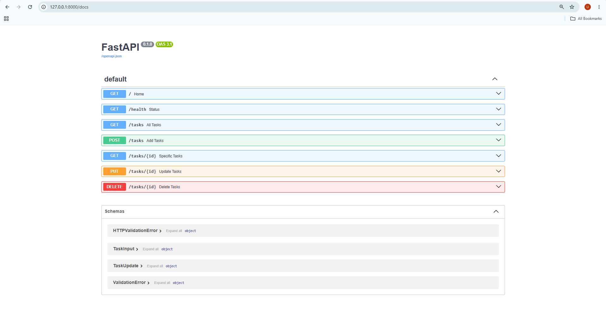

# W2 - A1: Build Your First CRUD API

## What is this

A Task Manager API built with FastAPI and Python. Manages a to-do list with full CRUD — create, read, update, and delete tasks. Data lives in memory, which means it disappears on restart. That's not a bug, that's the whole point of next week.

## How to Run

```bash
pip install fastapi uvicorn
uvicorn main:app --reload
```

## Endpoints

```
GET    /              - API info
GET    /health        - Health check  
GET    /tasks         - Get all tasks
GET    /tasks/{id}    - Get one task by ID
POST   /tasks         - Create a new task
PUT    /tasks/{id}    - Update title or done status
DELETE /tasks/{id}    - Remove a task
```

## Status Codes

```
200 - Got it
201 - Created it
204 - Deleted it, nothing to say
400 - Your request is broken
404 - That doesn't exist here
```

## curl Example

```bash
curl -i -X POST http://localhost:8000/tasks -H "Content-Type: application/json" -d '{"title":"Buy milk"}'
```

```
HTTP/1.1 201 Created
{"id":4,"title":"Buy milk","done":false}
```

## Swagger UI

```
Open http://localhost:8000/docs to test all endpoints visually.
```

!

## What I Learned

```
- Flask and FastAPI both build APIs but FastAPI comes with Swagger built in — no setup needed
- Uvicorn runs FastAPI the same way python app.py runs Flask
- curl is just a terminal version of what the browser does — except you can send POST, PUT, DELETE too
- Status codes are how your API talks to the client — 200 means ok, 201 means created, 204 means done but nothing to say, 400 means the request is broken, 404 means the thing doesn't exist
- Pydantic validates incoming data automatically — you define the shape, FastAPI enforces it
- GET requests can be tested in the browser but POST PUT DELETE need curl or Swagger
- In-memory means the data lives in a Python list — fast and simple but gone the moment the server stops
- The loop + if pattern for finding and updating items in a list is the same logic every database query uses under the hood
```