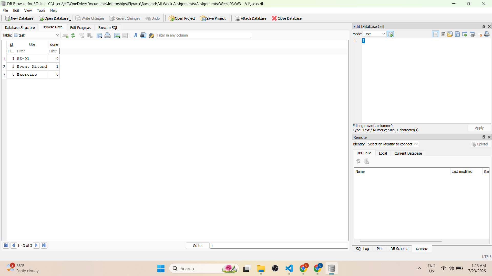

# W3 - A1: Connecting CRUD to a Database

## What is this

Same API as W2-A1. Same endpoints, same routes, same status codes. The only thing that changed is where the data lives from a Python list to a real SQLite database.

## Why SQLite

No installation or server need. Just a single file called `tasks.db` that gets created automatically when you run the app. Each fresh clone starts with its own clean database.

## How to Run

```bash
pip install fastapi uvicorn sqlmodel
uvicorn main:app --reload
```

## Endpoints

```
GET    /              - API info
GET    /health        - Health check
GET    /tasks         - Get all tasks (supports ?done= and ?search= filters)
GET    /tasks/{id}    - Get one task by ID
POST   /tasks         - Create a new task
PUT    /tasks/{id}    - Update title or done status
DELETE /tasks/{id}    - Remove a task
GET    /stats         - Task statistics
POST   /reset         - Reset to original 3 tasks
```

## Status Codes

```
200 - Success
201 - Created
204 - Deleted
400 - Bad request
404 - Not found
```

## curl Example

```bash
curl -i -X POST http://localhost:8000/tasks -H "Content-Type: application/json" -d '{"title":"Buy milk"}'
```

```
HTTP/1.1 201 Created
{"id":4,"title":"Buy milk","done":false}
```

## Database Screenshot



## SQL Query from Stage 4

```sql
SELECT * FROM tasks WHERE done = 1;
```
## AI vs. Me

**What AI did better:**
ChatGPT added connect_args={"check_same_thread": False} to the engine which prevents SQLite threading issues I didn't know this was needed.

**What AI got wrong:**
Used the deprecated @app.on_event("startup") instead of the modern lifespan approach.

**What AI silently decided:**
Added __tablename__ = "tasks" explicitly, added multi-threading support, and added a custom validation error handler none of which I specified in my prompt.

**What I improved in my prompt:**
Added that the lifespan approach should be used instead of on_event startup.

## What Actually Clicked

- Deleted all tasks from DB Browser, hit GET /tasks — empty. No restart needed, the API just reflects whatever is in the database at that moment
- Before, finding a task meant looping through a list manually. Now session.get(Task, id) handles it in one line
- Nothing saves until you call session.commit() — like clicking save on a document, changes sit in memory until then
- The API didn't change at all — same URLs, same responses, just different storage behind it. That separation finally made sense here