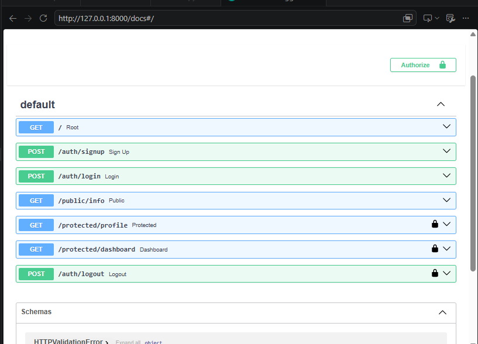

# W4 - A1: Auth Login & Protect

## What is this

A secure API with signup, login, and logout using Supabase as the identity provider. Protects specific routes with JWT bearer tokens, only users with a valid token can access `/protected/profile` and `/protected/dashboard`.

## Setup

Copy `.env.example` to `.env` and fill in your Supabase project details:

```
SUPABASE_URL=your_project_url
SUPABASE_KEY=your_anon_key
```

Get these from your Supabase Dashboard under Project Settings → API.

## How to Run

```bash
pip install fastapi uvicorn supabase python-dotenv
uvicorn main:app --reload
```

Open `http://localhost:8000/docs` for Swagger UI.

## Endpoints

| Method | Endpoint | Auth Required | Description |
|--------|----------|----------------|-------------|
| POST | `/auth/signup` | No | Create a new user account |
| POST | `/auth/login` | No | Log in, returns access token |
| POST | `/auth/logout` | Yes | End the current session |
| GET | `/public/info` | No | Public info, no login needed |
| GET | `/protected/profile` | Yes | Returns logged-in user's data |
| GET | `/protected/dashboard` | Yes | Second protected route, proves middleware works on any route |


## curl Example

```bash
curl -i -X POST http://localhost:8000/auth/login -H "Content-Type: application/json" -d '{"email":"you@example.com","password":"yourpassword"}'
```

Then use the returned `access_token` on protected routes:

```bash
curl -i http://localhost:8000/protected/profile -H "Authorization: Bearer <your_access_token>"
```

## Swagger UI with Bearer Auth

Click the lock icon, paste your access token (no "Bearer " prefix needed — Swagger adds it automatically), then test protected routes directly from the browser.



## What Actually Clicked

- JWT is basically a digital ID card — Supabase issues it once at login, and the server just checks if it's real without asking Supabase every single time in a full production setup (though this assignment does verify with Supabase directly for simplicity)
- Headers carry different information than the request body, email/password go in the body but the token goes in the Authorization header like a stamp on an envelope rather than the letter itself
- Depends() lets one small function (verify_token) guard multiple routes, write the check once reuse it everywhere instead of copy-pasting verification logic into every protected endpoint
- The hardest part was getting protected routes working properly in Swagger, the lock icon and bearer auth setup took real trial and error to get the header actually reaching the server
